

<strong style="display:block; font-size:28px; font-weight:700; color:#a67c52; line-height:1.2;">Federico Gabriel Castro</strong>
Software Engineer

<h3 style="color:#a67c52; font-family:system-ui,-apple-system,Segoe UI,Roboto,Helvetica,Arial,sans-serif; font-size:15px; font-weight:700; margin:0 0 8px 0; text-align:left;">Backend Development</h3>

PythonDjangoDRFFlaskFastAPIPydanticSQLAlchemyCeleryNode.jsExpressTypeScriptRESTPostgreSQLMongoDBRedisStripeFirebasemypyPoetryisortflake8Black

<h3 style="color:#a67c52; font-family:system-ui,-apple-system,Segoe UI,Roboto,Helvetica,Arial,sans-serif; font-size:15px; font-weight:700; margin:16px 0 8px 0; text-align:left;">Frontend Development</h3>

ReactTypeScriptRemixVueSvelteNext.jsTailwind CSSGraphQLWebpackBabelESLintPrettierSassMicrofrontendsReduxRedux SagasReact QueryGoogle Tag ManagerPixelYourSiteStripe.js

<h3 style="color:#a67c52; font-family:system-ui,-apple-system,Segoe UI,Roboto,Helvetica,Arial,sans-serif; font-size:15px; font-weight:700; margin:16px 0 8px 0; text-align:left;">Testing</h3>

PlaywrightVitestJestpytestpytest-djangounittestcoveragefactory-boyDjango TestCaseGitHub Actions

<h3 style="color:#a67c52; font-family:system-ui,-apple-system,Segoe UI,Roboto,Helvetica,Arial,sans-serif; font-size:15px; font-weight:700; margin:16px 0 8px 0; text-align:left;">Blockchain &amp; Web3</h3>

BlockchainMetaMaskEthereumSoliditySmart contractsOpenZeppelinethers.jsweb3.jsIPFSNFTs

<h3 style="color:#a67c52; font-family:system-ui,-apple-system,Segoe UI,Roboto,Helvetica,Arial,sans-serif; font-size:15px; font-weight:700; margin:16px 0 8px 0; text-align:left;">DevOps &amp; Infrastructure</h3>

DockerKubernetesDocker ComposeLinuxGitLab CIVercelSwaggerGoogle CloudFirebase Hosting

<h3 style="color:#a67c52; font-family:system-ui,-apple-system,Segoe UI,Roboto,Helvetica,Arial,sans-serif; font-size:15px; font-weight:700; margin:16px 0 8px 0; text-align:left;">Mobile Development</h3>

React NativeTypeScriptExpoFlutterDartSwiftFirebase

<a href="https://www.amazon.es/Building-Multi-Tenant-Saas-Architectures-Principles/dp/1098140648/" target="_blank" rel="noopener noreferrer">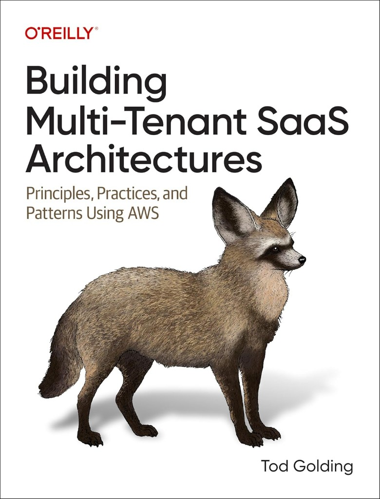</a><a href="https://www.amazon.es/Building-Scalable-Apps-Node-js-Express/dp/8197223815/" target="_blank" rel="noopener noreferrer">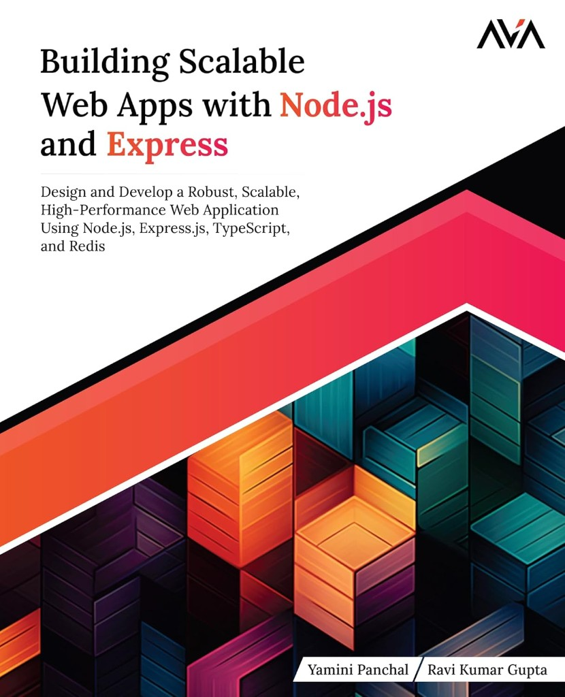</a><a href="https://www.amazon.es/Javascript-Definitive-Most-Used-Programming-Language/dp/1491952024/" target="_blank" rel="noopener noreferrer">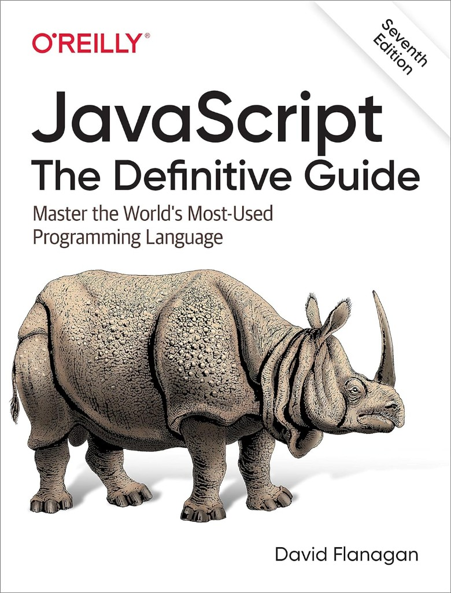</a><a href="https://www.amazon.es/Programming-TypeScript-Making-JavaScript-Applications/dp/1492037656/" target="_blank" rel="noopener noreferrer">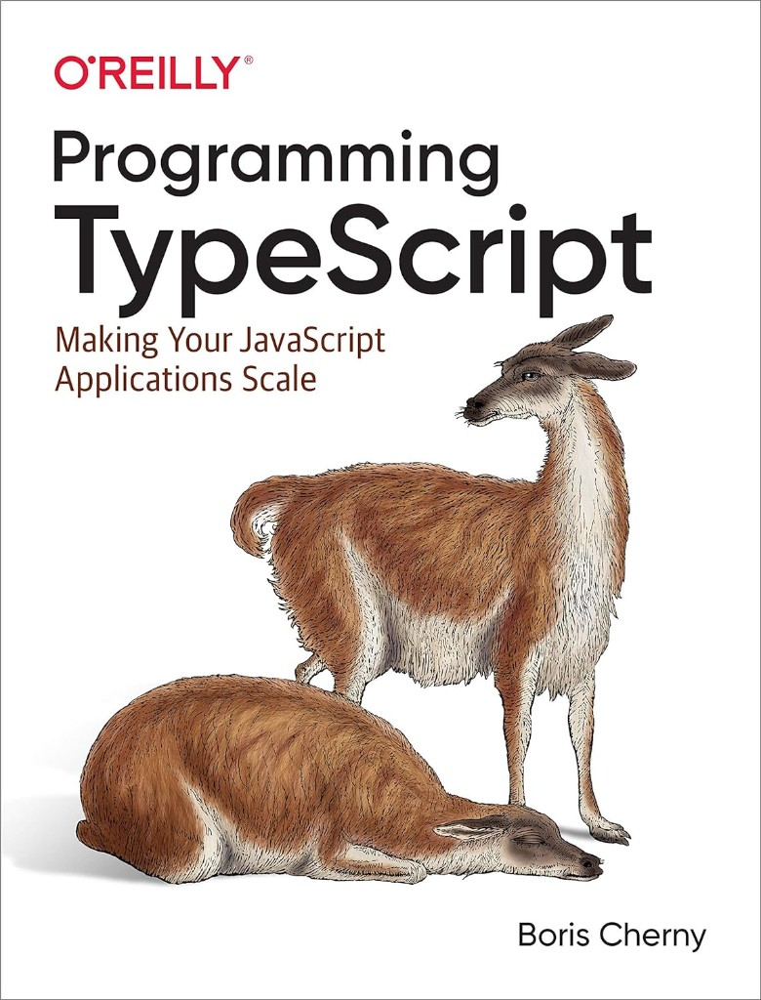</a><a href="https://www.amazon.es/Fluent-React-Performant-Intuitive-Applications/dp/1098138716/" target="_blank" rel="noopener noreferrer">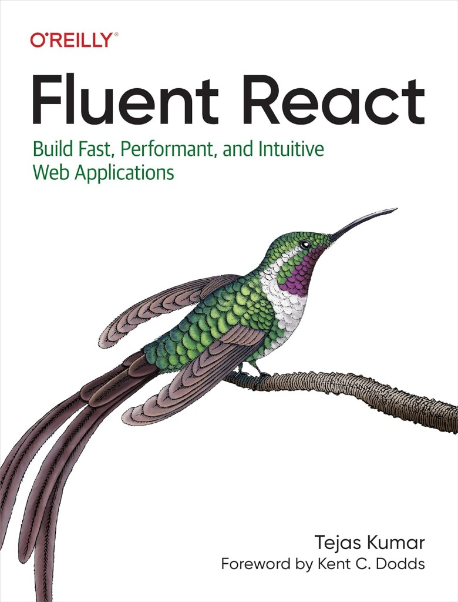</a><a href="https://www.amazon.es/Ultimate-Tailwind-CSS-Handbook-immersive/dp/9388590767/" target="_blank" rel="noopener noreferrer">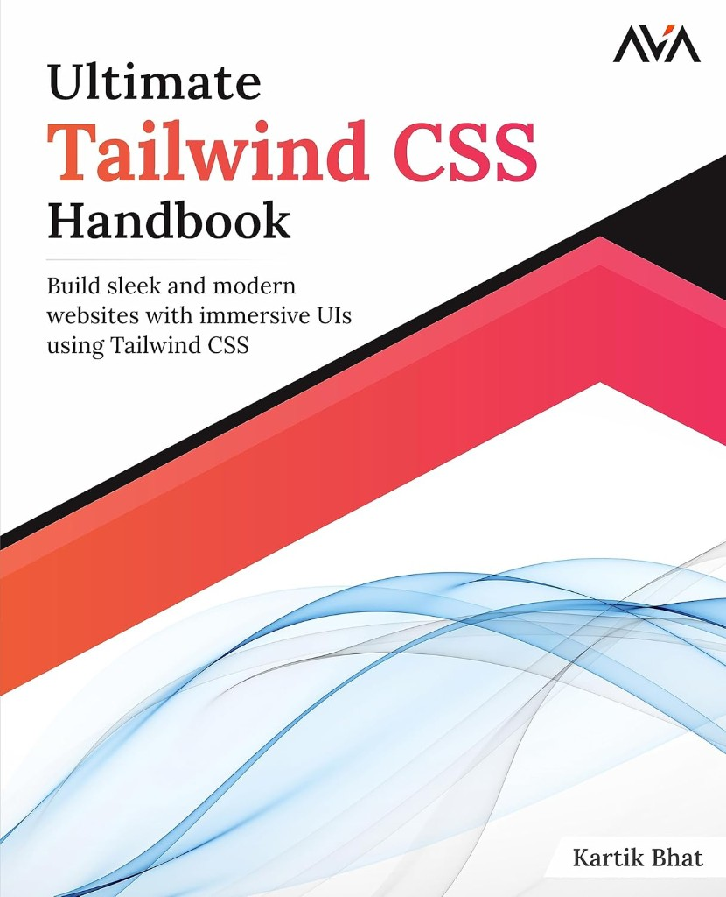</a><a href="https://www.amazon.es/Full-Stack-Development-Remix-production-ready/dp/1801075298/" target="_blank" rel="noopener noreferrer">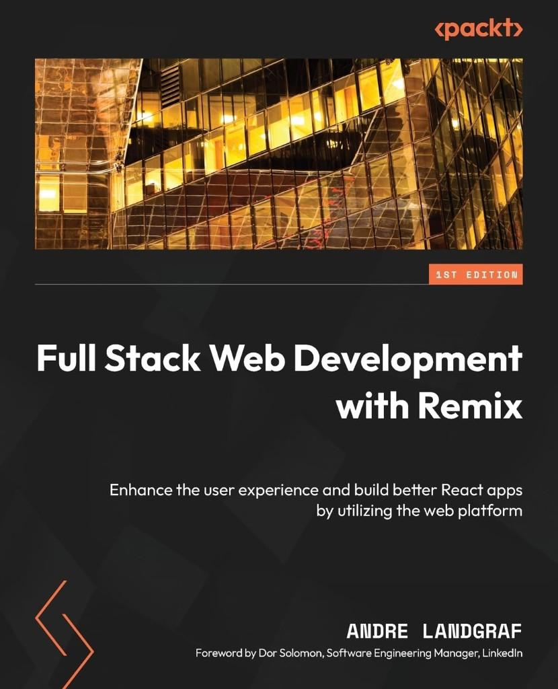</a><a href="https://www.amazon.es/Modern-Web-Applications-Next-JS-Techniques/dp/938859097X/" target="_blank" rel="noopener noreferrer">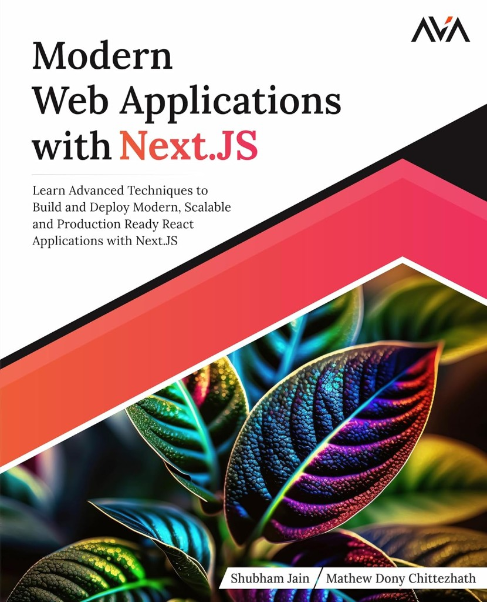</a><a href="https://www.amazon.es/Mastering-API-Architecture-Distributed-Microservices/dp/1492090638/" target="_blank" rel="noopener noreferrer">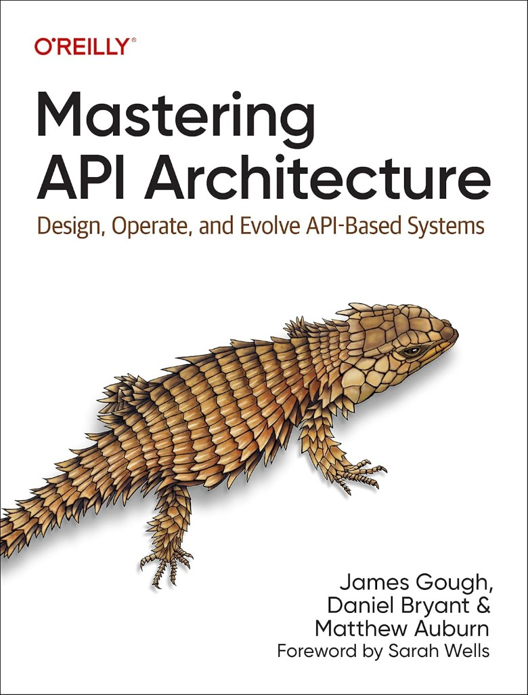</a><a href="https://www.amazon.com/Micro-Frontends-Action-Michael-Geers/dp/1617296872/" target="_blank" rel="noopener noreferrer">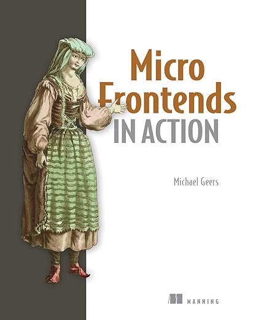</a><a href="https://www.amazon.com/Python-Cookbook-Third-David-Beazley/dp/1449340377/" target="_blank" rel="noopener noreferrer">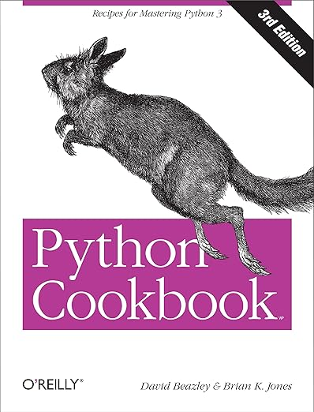</a><a href="https://www.amazon.es/Clean-Architecture-Craftsmans-Software-Structure/dp/0134494164/" target="_blank" rel="noopener noreferrer">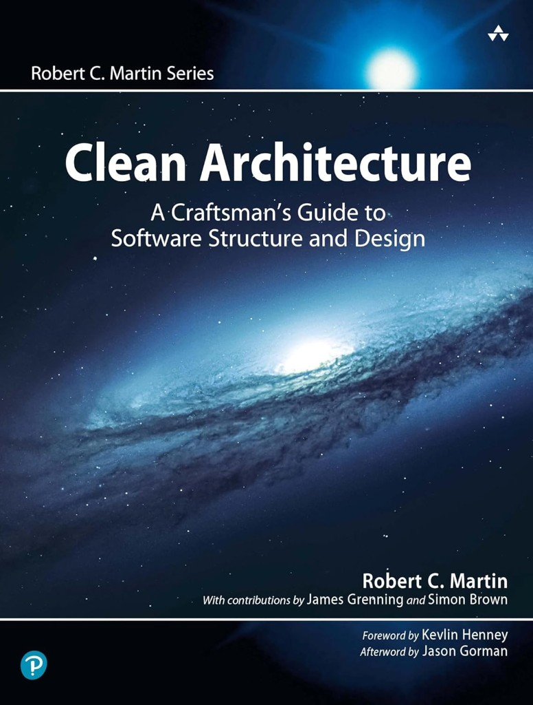</a><a href="https://www.amazon.es/Ultimate-Django-Development-Using-Python/dp/8196815115/" target="_blank" rel="noopener noreferrer">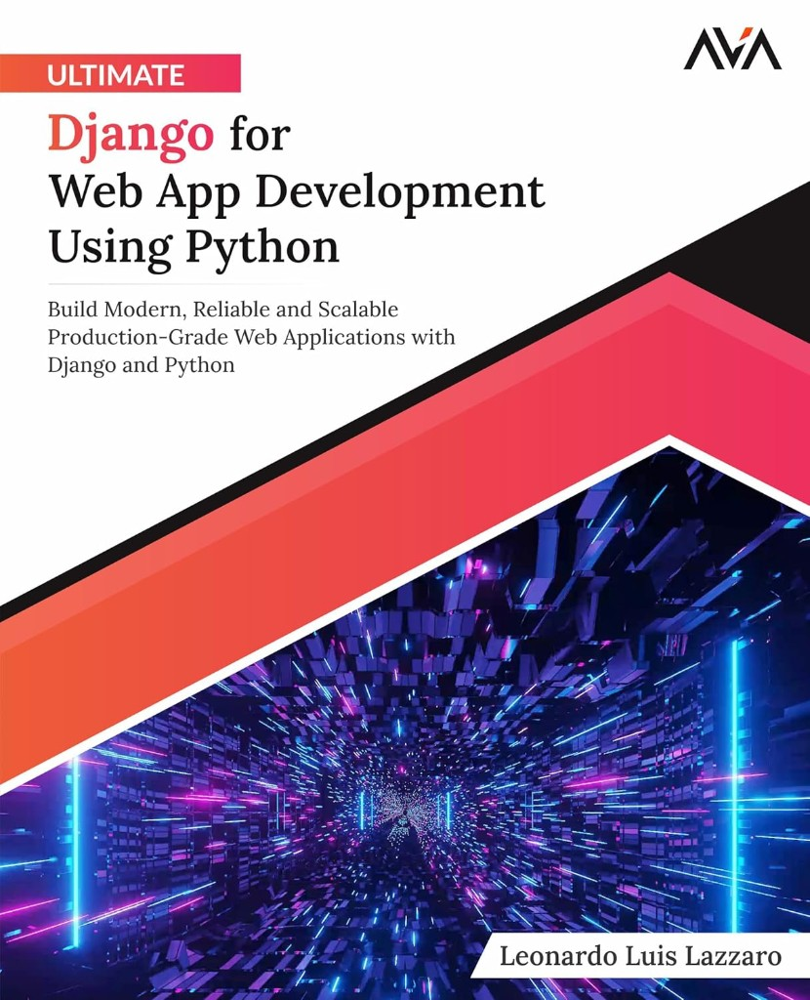</a>

