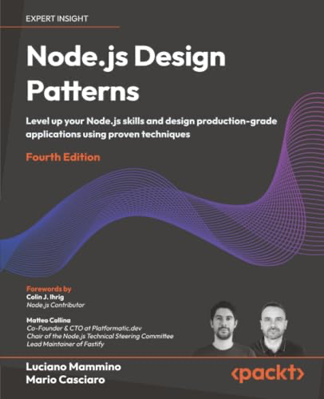
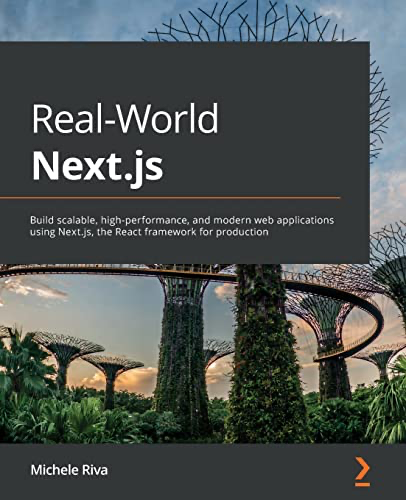
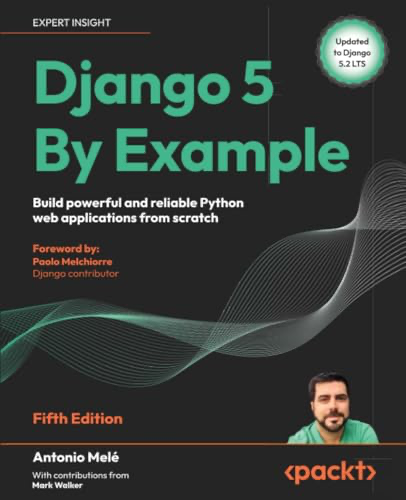
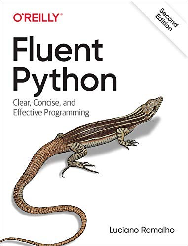
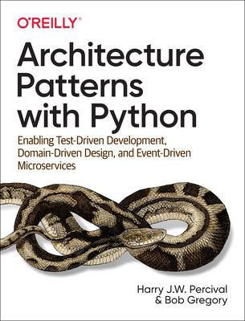
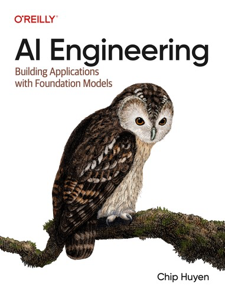
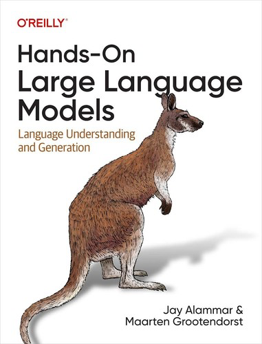
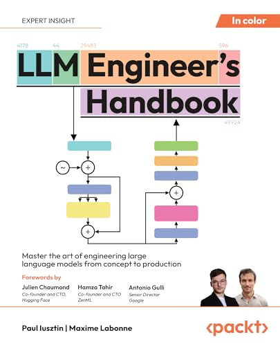
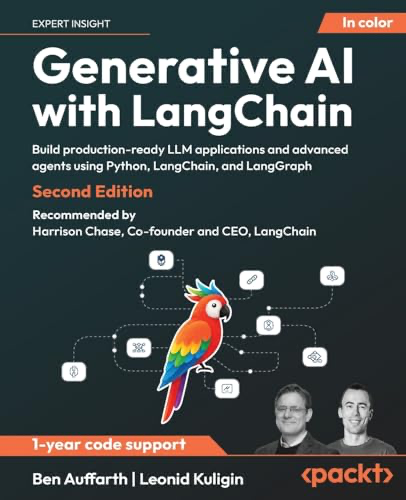

Full stack AI engineer. I ship products end to end: <strong>Django</strong> and DRF on the backend, <strong>React</strong> and TypeScript on the frontend, and <strong>LLM systems</strong> for RAG, agents, classification, and document analysis. Python and Node when the API needs it; Next.js or Remix when the UI does. Claude and Cursor are how I move faster — pytest, Playwright, and Docker are how I ship without surprises.

<strong><big>Skills</big></strong>

<strong>Backend</strong>

&nbsp;
&nbsp;
&nbsp;
&nbsp;
&nbsp;
&nbsp;
&nbsp;
&nbsp;
&nbsp;
&nbsp;
&nbsp;
&nbsp;
&nbsp;
&nbsp;
&nbsp;
&nbsp;
&nbsp;

<strong>Frontend</strong>

&nbsp;
&nbsp;
&nbsp;
&nbsp;
&nbsp;
&nbsp;
&nbsp;
&nbsp;
&nbsp;
&nbsp;
&nbsp;
&nbsp;
&nbsp;
&nbsp;
&nbsp;

<strong>AI</strong>

&nbsp;
&nbsp;
&nbsp;
&nbsp;
&nbsp;
&nbsp;
&nbsp;
&nbsp;
&nbsp;
&nbsp;
&nbsp;
&nbsp;

<strong>Testing &amp; DevOps</strong>

&nbsp;
&nbsp;
&nbsp;
&nbsp;
&nbsp;
&nbsp;
&nbsp;
&nbsp;
&nbsp;
&nbsp;
&nbsp;
&nbsp;
&nbsp;

<a href="https://github.com/FedericoGabrielCastro/Apollo"><strong>Apollo</strong></a> 
Scheduled probes, incidents, alerts, and a public status page. 

<a href="https://github.com/FedericoGabrielCastro/Mnemosyne"><strong>Mnemosyne</strong></a> 
Upload docs, retrieve by meaning, get cited answers — all on-device. 

<a href="https://github.com/FedericoGabrielCastro/Athena"><strong>Athena</strong></a> 
Category, priority, tags, and confidence — Ollama when available, TF-IDF fallback. 

<a href="https://github.com/FedericoGabrielCastro/Prometheus"><strong>Prometheus</strong></a> 
Agent loop that calls a model, runs tools, and feeds results back until the job is done. 

<a href="https://github.com/FedericoGabrielCastro/Ares"><strong>Ares</strong></a> 
In-process job queue with live SSE updates and a React dashboard — no auth or DB required. 

<a href="https://github.com/FedericoGabrielCastro/Hermes"><strong>Hermes</strong></a> 
API gateway and webhook console with retries, a dead-letter queue, and OpenAPI. 

&nbsp;&nbsp;&nbsp;&nbsp;&nbsp;

&nbsp;&nbsp;&nbsp;&nbsp;&nbsp;

&nbsp;&nbsp;&nbsp;&nbsp;&nbsp;

&nbsp;&nbsp;&nbsp;&nbsp;&nbsp;

&nbsp;&nbsp;&nbsp;&nbsp;&nbsp;

&nbsp;&nbsp;&nbsp;&nbsp;&nbsp;

&nbsp;&nbsp;&nbsp;&nbsp;&nbsp;

&nbsp;&nbsp;&nbsp;&nbsp;&nbsp;

&nbsp;&nbsp;&nbsp;&nbsp;&nbsp;

&nbsp;&nbsp;&nbsp;&nbsp;&nbsp;

&nbsp;&nbsp;&nbsp;&nbsp;&nbsp;

&nbsp;&nbsp;&nbsp;&nbsp;&nbsp;

&nbsp;&nbsp;&nbsp;&nbsp;&nbsp;

&nbsp;&nbsp;&nbsp;&nbsp;&nbsp;

&nbsp;&nbsp;&nbsp;&nbsp;&nbsp;

&nbsp;&nbsp;&nbsp;&nbsp;&nbsp;

&nbsp;&nbsp;&nbsp;&nbsp;&nbsp;

&nbsp;&nbsp;&nbsp;&nbsp;&nbsp;

